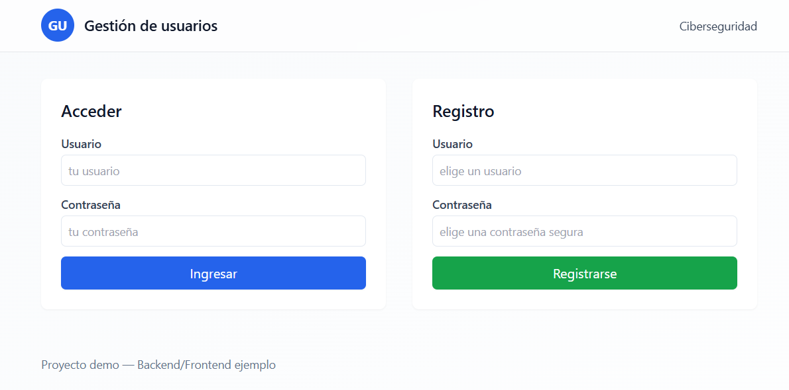
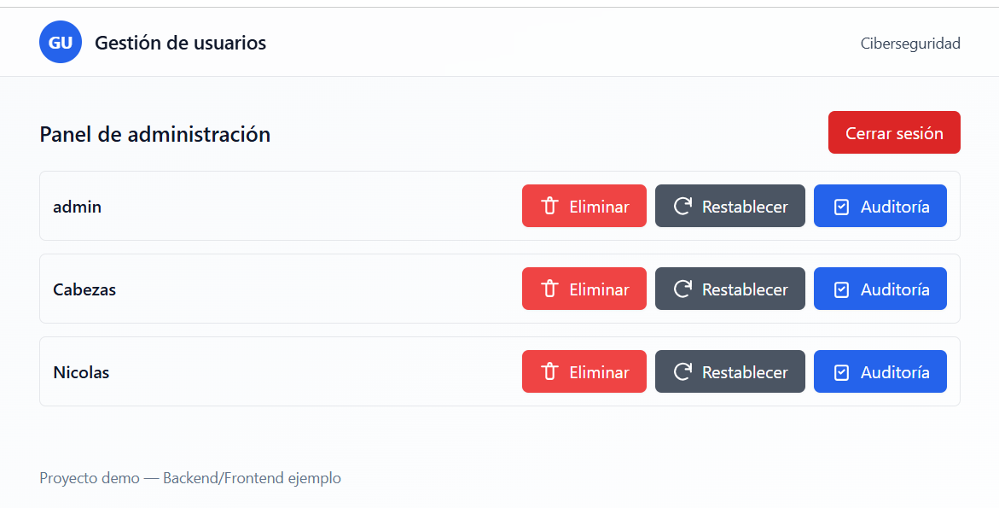
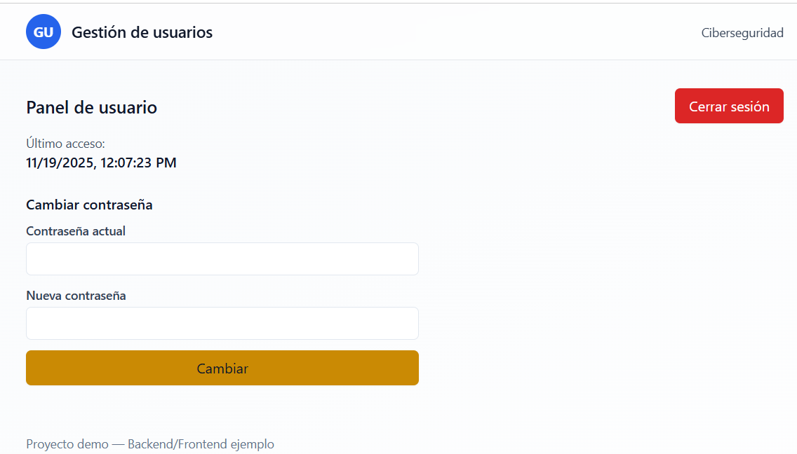
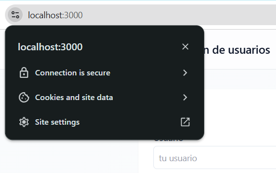
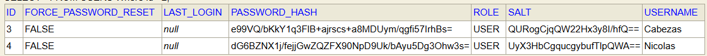

# User Management System - Sistema de Gestión de Usuarios

[](https://spring.io/projects/spring-boot)
[](https://reactjs.org/)
[](https://www.oracle.com/java/)
[](https://en.wikipedia.org/wiki/PBKDF2)
[](https://en.wikipedia.org/wiki/HTTPS)

Sistema web seguro de gestión de usuarios con autenticación mediante JWT, encriptación de contraseñas usando PBKDF2 con salt, comunicación HTTPS end-to-end, y panel de administración para gestión de usuarios.

---

## 📋 Tabla de Contenidos

- [Descripción del Proyecto](#-descripción-del-proyecto)
- [Informe del Proyecto](#-informe-del-proyecto)
  - [Metodología de Desarrollo](#metodología-de-desarrollo)
  - [Dificultades Encontradas](#dificultades-encontradas)
  - [Conclusiones](#conclusiones)
- [Arquitectura del Sistema](#-arquitectura-del-sistema)
- [Seguridad y Encriptación](#-seguridad-y-encriptación)
- [Configuración HTTPS](#-configuración-https)
- [Requisitos Previos](#-requisitos-previos)
- [Instalación y Ejecución](#-instalación-y-ejecución)
- [Acceso a la Base de Datos](#-acceso-a-la-base-de-datos)
- [Funcionalidades](#-funcionalidades)
- [Capturas de Pantalla](#-capturas-de-pantalla)
- [Tecnologías Utilizadas](#-tecnologías-utilizadas)
- [Estructura del Proyecto](#-estructura-del-proyecto)

---

## 🎯 Descripción del Proyecto

Este proyecto implementa una **plataforma de gestión de usuarios** que cumple con los siguientes requisitos de seguridad:

### Enunciado Original
> **Funcionalidad de login para una plataforma**: Este programa debe permitir gestionar los nombres de usuario y contraseñas de una plataforma cualquiera. Debe tener dos tipos de usuarios: el administrador (debe haber solamente uno) y los usuarios comunes. El usuario administrador debe poder consultar los nombres de los usuarios existentes, eliminar un usuario o poner en blanco la contraseña de un usuario. Los usuarios comunes deben poder consultar su última fecha/hora de login, y cambiar su contraseña. Las contraseñas deben almacenarse en un archivo de texto o base de datos, empleando salt. Se sugiere investigar y emplear el algoritmo PBKDF2 para el hashing de las contraseñas.

### Características Implementadas

✅ **Autenticación segura** con JWT (JSON Web Tokens)  
✅ **Encriptación de contraseñas** usando PBKDF2-HMAC-SHA256 con salt único por usuario  
✅ **Dos roles de usuario**: Administrador y Usuario común  
✅ **Panel de administrador** con gestión completa de usuarios  
✅ **Panel de usuario** con visualización de último login y cambio de contraseña  
✅ **Comunicación HTTPS** en frontend y backend con certificados autofirmados  
✅ **Base de datos H2** con persistencia de usuarios, auditoría de logins y refresh tokens  
✅ **Refresh tokens** para renovación automática de sesión  
✅ **Auditoría de logins** con registro de IP y timestamp  

---

## 📝 Informe del Proyecto

### Metodología de Desarrollo

El desarrollo del sistema se realizó siguiendo una arquitectura de tres capas:

1. **Capa de Presentación (Frontend)**
   - Desarrollada con **React 18** y **Tailwind CSS**
   - Implementación de componentes reutilizables (`Input`, `Button`, `Notification`, `ConfirmDialog`)
   - Páginas principales: Login, Register, AdminPanel, UserPanel
   - Proxy configurado para comunicación HTTPS con el backend

2. **Capa de Lógica de Negocio (Backend)**
   - Implementada con **Spring Boot 3.2.0** y **Spring Security**
   - Controladores REST (`AuthController`, `AdminController`, `AuditController`)
   - Servicios de autenticación (`AuthService`, `RefreshTokenService`)
   - Filtros JWT personalizados para validación de tokens en cada petición

3. **Capa de Datos (Persistencia)**
   - Base de datos **H2** en modo in-memory para desarrollo
   - Repositorios JPA: `UserRepository`, `LoginAuditRepository`, `RefreshTokenRepository`
   - Inicialización de datos con `data.sql` (usuario admin predeterminado)

### Proceso de Implementación

#### 1. **Sistema de Encriptación PBKDF2**
Se implementó la clase `Pbkdf2Password.java` utilizando la API criptográfica estándar de Java (`javax.crypto`):

```java
ALGORITHM: PBKDF2WithHmacSHA256
ITERATIONS: 310,000 (cumple con recomendaciones OWASP 2023)
KEY_LENGTH: 256 bits
SALT: 16 bytes aleatorios generados con SecureRandom
```

El salt se genera de forma única para cada usuario y se almacena junto con el hash en la base de datos. Esto previene ataques de rainbow tables y fuerza bruta.

#### 2. **Sistema de Autenticación JWT**
Se implementó autenticación stateless usando:
- **Access Token**: válido por 5 minutos (configurable en `application.yml`)
- **Refresh Token**: válido por 7 días, almacenado en la BD con posibilidad de revocación
- **Secure Cookies**: las cookies contienen el flag `Secure` y `HttpOnly` para prevenir XSS/CSRF

#### 3. **Configuración HTTPS End-to-End**
Para garantizar confidencialidad e integridad de las comunicaciones:
- Backend sirve en `https://localhost:8080` usando keystore PKCS#12
- Frontend sirve en `https://localhost:3000` usando certificados PEM
- Ambos comparten el mismo certificado autofirmado con Subject Alternative Names (SAN)

### Dificultades Encontradas

#### 🔴 **1. Configuración de Certificados HTTPS**

**Problema principal**: Los navegadores modernos (Chrome, Firefox, Edge) rechazan certificados autofirmados que no incluyen **Subject Alternative Names (SAN)**, incluso si se importan como confiables en el sistema operativo.

**Proceso de solución**:

1. **Intento inicial**: Generación de keystore con `keytool` (herramienta Java):
   ```cmd
   keytool -genkeypair -alias localdev -keyalg RSA -keysize 2048 -storetype PKCS12 \
     -keystore src/main/resources/keystore.p12 -validity 3650 \
     -dname "CN=localhost, OU=Dev, O=Icesi, L=Cali, ST=CA, C=CO" \
     -storepass changeit -keypass changeit
   ```
   **Resultado**: El certificado no incluía SAN, provocando errores `NET::ERR_CERT_COMMON_NAME_INVALID` en Chrome.

2. **Solución temporal**: Exportar certificados desde el keystore:
   ```cmd
   openssl pkcs12 -in backend/src/main/resources/keystore.p12 -nocerts -nodes \
     -passin pass:changeit -out certs/localhost-key.pem
   openssl pkcs12 -in backend/src/main/resources/keystore.p12 -clcerts -nokeys \
     -passin pass:changeit -out certs/localhost.pem
   ```
   **Resultado**: Los certificados extraídos seguían sin SAN.

3. **Solución final**: Regenerar certificado con OpenSSL incluyendo SAN explícitamente:
   ```cmd
   openssl req -x509 -nodes -days 3650 -newkey rsa:2048 \
     -keyout certs/localhost-key.pem -out certs/localhost.pem \
     -subj "/CN=localhost" \
     -addext "subjectAltName = DNS:localhost, IP:127.0.0.1, IP:::1"
   ```
   Luego, convertir a PKCS#12 para Spring Boot:
   ```cmd
   openssl pkcs12 -export -out backend/src/main/resources/keystore.p12 \
     -inkey certs/localhost-key.pem -in certs/localhost.pem \
     -passout pass:changeit -name tomcat
   ```

4. **Importación en Windows**: Para que el navegador confíe en el certificado:
   ```cmd
   certutil -user -addstore Root certs\localhost.pem
   ```
   (Requiere reiniciar el navegador después de la importación)

**Lección aprendida**: Los certificados autofirmados para desarrollo deben incluir SAN que coincidan con los dominios/IPs de acceso. La herramienta `mkcert` hubiera simplificado este proceso.

#### 🔴 **2. Configuración de Cookies Seguras**

**Problema**: Las cookies con el flag `Secure` solo se envían sobre HTTPS. Durante el desarrollo inicial con HTTP, los tokens no se transmitían correctamente.

**Solución**: Configurar tanto frontend como backend para usar HTTPS desde el inicio del desarrollo, y ajustar `application.yml`:
```yaml
app:
  security:
    secure-cookies: true
  ssl-enabled: true
```

#### 🔴 **3. CORS con Credenciales**

**Problema**: Los navegadores bloquean peticiones cross-origin con credenciales si el servidor no configura correctamente `Access-Control-Allow-Credentials`.

**Solución**: Implementar `CorsConfig.java` con configuración explícita:
```java
.allowedOrigins("https://localhost:3000")
.allowCredentials(true)
.allowedMethods("GET", "POST", "PUT", "DELETE", "OPTIONS")
```

#### 🔴 **4. Verificación de Contraseñas con PBKDF2**

**Desafío**: PBKDF2 es computacionalmente costoso (310,000 iteraciones), lo cual es correcto para seguridad pero requiere optimización.

**Solución**: El uso de librerías estándar de Java (`javax.crypto.SecretKeyFactory`) garantiza implementación optimizada y evita errores de implementación manual.

### Conclusiones

1. **Seguridad por diseño**: La implementación de PBKDF2 con salt único por usuario y 310,000 iteraciones proporciona protección robusta contra ataques de fuerza bruta y rainbow tables, cumpliendo con estándares actuales de la industria (OWASP, NIST).

2. **HTTPS como requisito fundamental**: La configuración de HTTPS end-to-end no es opcional en aplicaciones modernas. Los navegadores rechazan activamente cookies seguras sobre HTTP y marcan sitios sin HTTPS como "no seguros", afectando la experiencia de usuario.

3. **Complejidad de certificados autofirmados**: Los certificados autofirmados requieren configuración manual detallada (SAN, importación en almacén de confianza) que puede ser propensa a errores. Para entornos de producción, es crítico usar certificados emitidos por CAs reconocidas (Let's Encrypt, DigiCert, etc.).

4. **Arquitectura JWT efectiva**: El uso de access tokens de corta duración (5 min) combinado con refresh tokens de larga duración (7 días) proporciona un balance entre seguridad y experiencia de usuario. Los refresh tokens almacenados en BD permiten revocación granular de sesiones.

5. **Separación de responsabilidades**: La arquitectura en capas (presentación, lógica de negocio, persistencia) facilita mantenimiento, testing y escalabilidad futura del sistema.

6. **Aprendizajes técnicos clave**:
   - OpenSSL es más flexible que `keytool` para generación de certificados con extensiones modernas (SAN)
   - Spring Security requiere configuración explícita de CORS cuando se usan credenciales
   - H2 en modo in-memory es excelente para desarrollo pero requiere servidor TCP para acceso externo
   - React dev server (`react-scripts`) soporta HTTPS nativamente mediante variables de entorno

7. **Mejoras futuras recomendadas**:
   - Migrar a base de datos persistente (PostgreSQL/MySQL) para producción
   - Implementar rate limiting para prevenir ataques de fuerza bruta en login
   - Añadir autenticación multifactor (MFA/2FA)

---

## 🏗️ Arquitectura del Sistema

### Diagrama de Componentes

```
┌─────────────────────────────────────────────────────────────┐
│                    FRONTEND (React)                         │
│  ┌──────────────┐  ┌──────────────┐  ┌──────────────┐       │
│  │Login/Register│  │ Admin Panel  │  │  User Panel  │       │
│  └──────┬───────┘  └──────┬───────┘  └──────┬───────┘       │
│         │                  │                  │             │
│         └──────────────────┼──────────────────┘             │
│                            │                                │
│                    HTTPS (Port 3000)                        │
└────────────────────────────┼────────────────────────────────┘
                             │
                    ┌────────▼────────┐
                    │  setupProxy.js  │
                    │  (CORS Proxy)   │
                    └────────┬────────┘
                             │
┌────────────────────────────▼─────────────────────────────────┐
│              BACKEND (Spring Boot)                           │
│                                                              │
│  ┌──────────────────────────────────────────────────────┐    │
│  │              Controllers Layer                       │    │
│  │  ┌────────────┐ ┌──────────┐ ┌──────────────┐        │    │
│  │  │AuthController│ │AdminCtrl │ │AuditCtrl   │        │    │
│  │  └─────┬──────┘ └────┬─────┘ └──────┬───────┘        │    │
│  └────────┼─────────────┼───────────────┼───────────────┘    │
│           │             │               │                    │
│  ┌────────▼─────────────▼───────────────▼──────────────┐     │
│  │              Services Layer                         │     │
│  │  ┌──────────┐ ┌──────────────┐ ┌──────────────┐     │     │
│  │  │AuthServic│ │RefreshToken  │ │JwtUtil       │     │     │
│  │  │          │ │Service       │ │              │     │     │
│  │  └─────┬────┘ └──────┬───────┘ └──────┬───────┘     │     │
│  └────────┼─────────────┼────────────────┼─────────────┘     │
│           │             │                │                   │
│  ┌────────▼─────────────▼────────────────▼──────────────┐    │
│  │              Security Layer                          │    │
│  │  ┌──────────────┐ ┌──────────────┐ ┌────────────┐    │    │
│  │  │Pbkdf2Password│ │JwtAuthFilter │ │SecurityConf│    │    │
│  │  └──────────────┘ └──────────────┘ └────────────┘    │    │
│  └──────────────────────────────────────────────────────┘    │
│           │             │                │                   │
│  ┌────────▼─────────────▼────────────────▼──────────────┐    │
│  │           Repositories (JPA)                         │    │
│  │  ┌──────────┐ ┌────────────┐ ┌──────────────┐        │    │
│  │  │UserRepo  │ │LoginAudit  │ │RefreshToken  │        │    │
│  │  │          │ │Repo        │ │Repo          │        │    │
│  │  └────┬─────┘ └─────┬──────┘ └──────┬───────┘        │    │
│  └───────┼─────────────┼────────────────┼───────────────┘    │
│          │             │                │                    │
│                   HTTPS (Port 8080)                          │
└──────────┼─────────────┼────────────────┼────────────────────┘
           │             │                │
┌──────────▼─────────────▼────────────────▼──────────────┐
│               H2 Database (In-Memory)                  │
│  ┌─────────┐  ┌──────────────┐  ┌──────────────┐       │
│  │  users  │  │ login_audit  │  │refresh_tokens│       │
│  │         │  │              │  │              │       │
│  │id       │  │id            │  │id            │       │
│  │username │  │username      │  │token         │       │
│  │password_│  │ip            │  │username      │       │
│  │  hash   │  │timestamp     │  │expiry_date   │       │
│  │salt     │  └──────────────┘  └──────────────┘       │
│  │role     │                                           │
│  │last_login│                                          │
│  │force_pwd│                                           │
│  │  reset  │                                           │
│  └─────────┘                                           │
└────────────────────────────────────────────────────────┘
```

### Flujo de Autenticación

```
1. Usuario envía credenciales (username, password) → AuthController
2. AuthService busca usuario en BD
3. Pbkdf2Password.verify() compara hash(password + salt) con hash almacenado
4. Si válido → JwtUtil genera access token + refresh token
5. Tokens se envían en cookies HttpOnly Secure
6. Cliente incluye cookies en peticiones subsecuentes
7. JwtAuthenticationFilter valida token en cada request
8. Si token expiró → cliente usa refresh token para obtener nuevo access token
```

---

## 🔒 Seguridad y Encriptación

### Implementación PBKDF2

El sistema utiliza **PBKDF2-HMAC-SHA256** para el hashing de contraseñas, implementado en `Pbkdf2Password.java`:

```java
ALGORITHM: PBKDF2WithHmacSHA256
ITERATIONS: 310,000  // Cumple OWASP 2023 recommendations
KEY_LENGTH: 256 bits
SALT_LENGTH: 16 bytes (128 bits)
```

#### ¿Por qué PBKDF2?

1. **Recomendado por OWASP y NIST**: Estándar de la industria para derivación de claves
2. **Resistente a ataques GPU**: Las 310,000 iteraciones hacen costoso el ataque de fuerza bruta
3. **Salt único por usuario**: Previene rainbow tables y ataques de diccionario precomputados
4. **Implementación estándar**: Usa librerías criptográficas de Java (`javax.crypto`), evitando errores de implementación

#### Proceso de Hashing

```java
// 1. Generación de salt (registro de usuario)
String salt = Pbkdf2Password.generateSalt();
// → Genera 16 bytes aleatorios usando SecureRandom
// → Codifica en Base64 para almacenamiento

// 2. Hashing de contraseña
String hash = Pbkdf2Password.hash(password.toCharArray(), salt);
// → Aplica PBKDF2 con 310,000 iteraciones
// → Devuelve hash de 256 bits en Base64

// 3. Almacenamiento en BD
user.setSalt(salt);
user.setPasswordHash(hash);

// 4. Verificación (login)
boolean valid = Pbkdf2Password.verify(inputPassword, storedSalt, storedHash);
// → Regenera hash con mismo salt y compara
```

#### Estructura en Base de Datos

Tabla `users`:
```sql
CREATE TABLE users (
    id BIGINT AUTO_INCREMENT PRIMARY KEY,
    username VARCHAR(255) NOT NULL UNIQUE,
    password_hash VARCHAR(255),    -- Hash PBKDF2 en Base64
    salt VARCHAR(255),              -- Salt único en Base64
    role VARCHAR(20) NOT NULL,      -- 'ADMIN' o 'USER'
    last_login TIMESTAMP,
    force_password_reset BOOLEAN DEFAULT FALSE
);
```

**Ejemplo de datos**:
```
username: admin
salt: aB3xK9pLmN4qR7sT2vW5yZ8cE1fG6hJ0
password_hash: xY9zC2bM5nP8qT1vW4aS7dF0gH3jK6lN9pR2sU5xZ8cE1fG4hJ7kL0mN3pQ6rT9vY2bM5
```

### JWT (JSON Web Tokens)

**Access Token** (corta duración - 5 minutos):
```javascript
{
  "sub": "admin",           // Username
  "role": "ADMIN",          // User role
  "iat": 1700000000,        // Issued at
  "exp": 1700000300         // Expires at (5 min después)
}
```

**Refresh Token** (larga duración - 7 días):
- Almacenado en base de datos con fecha de expiración
- Permite revocación granular (logout, cambio de contraseña)
- Solo válido para endpoint `/api/auth/refresh`

### Configuración de Cookies Seguras

```java
// SecurityConfig.java
Cookie cookie = new Cookie("refreshToken", token);
cookie.setHttpOnly(true);      // No accesible desde JavaScript (previene XSS)
cookie.setSecure(true);        // Solo se envía sobre HTTPS
cookie.setPath("/api/auth");   // Limitado a rutas de autenticación
cookie.setMaxAge(7 * 24 * 60 * 60); // 7 días
cookie.setSameSite("Strict");  // Previene CSRF
```

---

## 🔐 Configuración HTTPS

### ¿Por qué HTTPS?

1. **Confidencialidad**: Cifra toda la comunicación cliente-servidor
2. **Integridad**: Previene manipulación de datos en tránsito (MITM attacks)
3. **Autenticación**: Verifica identidad del servidor
4. **Requisito para cookies Secure**: Los navegadores solo envían cookies `Secure` sobre HTTPS

### Certificados Autofirmados con Subject Alternative Names (SAN)

Los navegadores modernos **requieren** que los certificados incluyan Subject Alternative Names (SAN) que coincidan con el dominio/IP de acceso.

#### Paso 1: Generar Certificado con SAN

```cmd
openssl req -x509 -nodes -days 3650 -newkey rsa:2048 \
  -keyout certs/localhost-key.pem \
  -out certs/localhost.pem \
  -subj "/CN=localhost" \
  -addext "subjectAltName = DNS:localhost, IP:127.0.0.1, IP:::1"
```

**Parámetros**:
- `-x509`: Certificado autofirmado
- `-nodes`: Sin cifrado de clave privada (solo desarrollo)
- `-days 3650`: Válido por 10 años
- `-newkey rsa:2048`: Clave RSA de 2048 bits
- `-addext "subjectAltName..."`: **Crítico** - incluye SAN para localhost, 127.0.0.1 y ::1 (IPv6)

#### Paso 2: Convertir a PKCS#12 para Spring Boot

```cmd
openssl pkcs12 -export \
  -out backend/src/main/resources/keystore.p12 \
  -inkey certs/localhost-key.pem \
  -in certs/localhost.pem \
  -passout pass:changeit \
  -name tomcat
```

#### Paso 3: Configurar Spring Boot

`application.yml`:
```yaml
server:
  port: 8080
  ssl:
    enabled: true
    key-store: classpath:keystore.p12
    key-store-password: changeit
    key-store-type: PKCS12

app:
  security:
    secure-cookies: true
  ssl-enabled: true
```

#### Paso 4: Importar Certificado en Windows (Para que el navegador confíe)

```cmd
# Opción 1: Almacén del usuario (no requiere privilegios admin)
certutil -user -addstore Root certs\localhost.pem

# Opción 2: Almacén del equipo (requiere ejecutar cmd.exe como Administrador)
certutil -addstore Root certs\localhost.pem
```

**Importante**: Después de importar, reinicia el navegador para que reconozca el certificado.

#### Paso 5: Verificar SAN del Certificado

```cmd
openssl x509 -in certs/localhost.pem -noout -text
```

Busca la sección:
```
X509v3 Subject Alternative Name:
    DNS:localhost, IP Address:127.0.0.1, IP Address:0:0:0:0:0:0:0:1
```

### Configuración HTTPS en Frontend (React)

Configurar variables de entorno antes de ejecutar `npm start`:

```cmd
set HTTPS=true
set SSL_CRT_FILE=..\certs\localhost.pem
set SSL_KEY_FILE=..\certs\localhost-key.pem
npm start
```

El dev server de React arrancará en `https://localhost:3000`.

### Proxy HTTPS en `setupProxy.js`

```javascript
const { createProxyMiddleware } = require('http-proxy-middleware');

module.exports = function(app) {
  app.use('/api', createProxyMiddleware({
      target: 'https://localhost:8080',
      changeOrigin: true,
      secure: false,  // Acepta certificados autofirmados en desarrollo
      logLevel: 'debug'
    })
  );
};
```

**Nota**: `secure: false` es aceptable **solo en desarrollo**. En producción, usar `secure: true` y certificados válidos de CA reconocida.

### Diagrama de Flujo HTTPS

```
┌─────────────────┐                    ┌─────────────────┐
│   Navegador     │                    │   Frontend      │
│                 │  HTTPS (TLS 1.3)   │  React Dev      │
│  localhost:3000 │◄──────────────────►│  Server         │
└─────────────────┘                    │  Port 3000      │
                                       └────────┬────────┘
                                                │
                                       HTTPS Proxy
                                       (setupProxy.js)
                                                │
                                       ┌────────▼────────┐
                                       │   Backend       │
                                       │  Spring Boot    │
                                       │  Port 8080      │
                                       │  (TLS/SSL)      │
                                       └─────────────────┘
```

---

## 📦 Requisitos Previos

- **Java 17** o superior ([Descargar](https://adoptium.net/))
- **Node.js 16+** y npm ([Descargar](https://nodejs.org/))
- **OpenSSL** (incluido en Git Bash para Windows, o instalar con Chocolatey: `choco install openssl`)
- **Maven** (incluido en el proyecto como wrapper: `mvnw.cmd`)
- Navegador moderno (Chrome, Firefox, Edge)

---

## 🚀 Instalación y Ejecución

### Opción 1: Ejecución Rápida (Sin HTTPS - Solo para pruebas locales)

#### Backend

```cmd
cd backend
mvnw.cmd spring-boot:run
```

Backend disponible en `http://localhost:8080`

#### Frontend

```cmd
cd frontend
npm install
npm start
```

Frontend disponible en `http://localhost:3000`

### Opción 2: Ejecución con HTTPS (Recomendado)

#### 1. Generar Certificados (Una sola vez)

```cmd
# Generar certificado con SAN
openssl req -x509 -nodes -days 3650 -newkey rsa:2048 ^
  -keyout certs\localhost-key.pem ^
  -out certs\localhost.pem ^
  -subj "/CN=localhost" ^
  -addext "subjectAltName = DNS:localhost, IP:127.0.0.1, IP:::1"

# Convertir a PKCS#12 para backend
openssl pkcs12 -export ^
  -out backend\src\main\resources\keystore.p12 ^
  -inkey certs\localhost-key.pem ^
  -in certs\localhost.pem ^
  -passout pass:changeit ^
  -name tomcat

# Importar certificado en Windows
certutil -user -addstore Root certs\localhost.pem
```

#### 2. Ejecutar Backend con HTTPS

```cmd
cd backend
mvnw.cmd spring-boot:run
```

Backend disponible en `https://localhost:8080`

#### 3. Ejecutar Frontend con HTTPS

```cmd
cd frontend
npm install
set HTTPS=true
set SSL_CRT_FILE=..\certs\localhost.pem
set SSL_KEY_FILE=..\certs\localhost-key.pem
npm start
```

Frontend disponible en `https://localhost:3000`

#### 4. Acceder a la Aplicación

Abre el navegador en `https://localhost:3000`

**Credenciales por defecto**:
- **Admin**: `admin` / `admin`
- **Usuario común**: Debes registrarlo primero

---

## 🗄️ Acceso a la Base de Datos

### H2 Console (Navegador)

1. Con el backend ejecutándose, abre en el navegador:
   ```
   https://localhost:8080/h2-console
   ```

2. Configura la conexión:
   ```
   JDBC URL: jdbc:h2:mem:testdb;DB_CLOSE_DELAY=-1;MODE=PostgreSQL
   User Name: sa
   Password: (dejar vacío)
   ```

3. Explora las tablas: `USERS`, `LOGIN_AUDIT`, `REFRESH_TOKENS`

### Verificar Salt y Hash de Contraseñas

```sql
SELECT username, 
       LEFT(salt, 10) || '...' AS salt_preview,
       LEFT(password_hash, 10) || '...' AS hash_preview,
       role,
       last_login
FROM users;
```

**Ejemplo de salida**:
```
username | salt_preview    | hash_preview    | role  | last_login
---------|-----------------|-----------------|-------|--------------------
admin    | aB3xK9pLmN...   | xY9zC2bM5n...   | ADMIN | 2025-11-19 10:30:00
user1    | qR7sT2vW5y...   | pT1vW4aS7d...   | USER  | 2025-11-19 09:15:00
```

### Generar Hash/Salt para Pruebas (DevPasswordUtil)

```cmd
cd backend
mvnw.cmd -DskipTests package
java -cp target\classes com.example.usermanagement.util.DevPasswordUtil "MiNuevaContraseña123!"
```

**Salida**:
```sql
-- Ejecuta la siguiente sentencia SQL en la consola H2 (o mediante JDBC) para fijar la contraseña del usuario 'admin':

UPDATE users SET salt='2xur/S+6eKyK54f0E77GpA==', password_hash='PtfofEC3lZusB3bA/3uSCfsklLMwj95AzQKNNZ0zlB4=' WHERE username='admin';

-- Luego accede al frontend y prueba iniciar sesión con el usuario 'admin' y la contraseña proporcionada.
```

---

## ✨ Funcionalidades

### Rol: Administrador

✅ **Ver lista de todos los usuarios**
- Muestra username, rol y último login
- Interfaz ordenada con iconos

✅ **Eliminar usuarios**
- Confirmación obligatoria antes de eliminar
- No puede eliminar a sí mismo
- No puede eliminar al único administrador

✅ **Resetear contraseñas**
- Pone la contraseña en blanco (`password_hash = NULL`)
- Usuario debe establecer nueva contraseña en siguiente login
- Flag `force_password_reset = true`

✅ **Ver auditoría de logins**
- Historial completo de logins
- Incluye username, IP, timestamp

### Rol: Usuario Común

✅ **Ver última fecha/hora de login**
- Se muestra en el panel principal del usuario
- Actualizada automáticamente en cada login exitoso

✅ **Cambiar contraseña**
- Requiere contraseña actual para validación
- Genera nuevo salt y hash con PBKDF2
- Revoca todos los refresh tokens existentes (cierra otras sesiones)

### Funcionalidades Comunes

✅ **Registro de nuevos usuarios**
- Username único
- Contraseña hasheada con PBKDF2 + salt
- Rol USER por defecto

✅ **Login seguro**
- Validación de credenciales con PBKDF2
- Emisión de JWT access token + refresh token
- Auditoría automática de login (IP + timestamp)

✅ **Refresh token automático**
- Frontend renueva access token cada 4 minutos
- Sesión persistente hasta 7 días sin necesidad de relogin

✅ **Logout**
- Revoca refresh token en servidor
- Limpia cookies del cliente
- Redirección a página de login

---

## 📸 Capturas de Pantalla

### Pantalla de Login


### Panel de Administrador


### Panel de Usuario Normal


### Certificado HTTPS Verificado


### Verificación de Hashing: Misma Contraseña, Diferentes Hashes (Salt Único)

*Demuestra que dos usuarios con la misma contraseña tienen hashes completamente diferentes debido al salt único*

---

## 📁 Estructura del Proyecto

```
user-management/
├── backend/
│   ├── src/main/java/com/example/usermanagement/
│   │   ├── UserManagementApplication.java
│   │   ├── config/
│   │   │   ├── CorsConfig.java
│   │   │   └── ...
│   │   ├── controller/
│   │   │   ├── AuthController.java          # Login, Register, Refresh
│   │   │   ├── AdminController.java         # Gestión de usuarios
│   │   │   └── AuditController.java         # Auditoría de logins
│   │   ├── dto/
│   │   │   ├── AuthRequest.java
│   │   │   ├── AuthResponse.java
│   │   │   └── ...
│   │   ├── model/
│   │   │   ├── User.java                    # Entidad Usuario (username, hash, salt, role)
│   │   │   ├── LoginAudit.java              # Auditoría de logins
│   │   │   └── RefreshToken.java            # Tokens de renovación
│   │   ├── repository/
│   │   │   ├── UserRepository.java
│   │   │   ├── LoginAuditRepository.java
│   │   │   └── RefreshTokenRepository.java
│   │   ├── security/
│   │   │   ├── Pbkdf2Password.java          #  Implementación PBKDF2
│   │   │   ├── JwtUtil.java                 # Generación/validación JWT
│   │   │   ├── JwtAuthenticationFilter.java # Filtro de autenticación
│   │   │   └── SecurityConfig.java          # Configuración Spring Security
│   │   ├── service/
│   │   │   ├── AuthService.java             # Lógica de autenticación
│   │   │   └── RefreshTokenService.java     # Gestión de refresh tokens
│   │   └── util/
│   │       ├── DevPasswordUtil.java         # Generador de hash/salt para desarrollo
│   │       └── PasswordGenerator.java
│   ├── src/main/resources/
│   │   ├── application.yml                  # Configuración SSL, BD, JWT
│   │   ├── data.sql                         # Datos iniciales (admin, user1)
│   │   └── keystore.p12                     # ⭐ Keystore PKCS#12 para HTTPS
│   ├── pom.xml
│   └── mvnw.cmd                             # Maven wrapper
├── frontend/
│   ├── src/
│   │   ├── App.js
│   │   ├── index.js
│   │   ├── setupProxy.js                    # ⭐ Proxy HTTPS para dev
│   │   ├── components/
│   │   │   ├── Button.js
│   │   │   ├── Input.js
│   │   │   ├── Notification.js
│   │   │   ├── ConfirmDialog.js
│   │   │   └── Layout.js
│   │   ├── pages/
│   │   │   ├── Login.js
│   │   │   ├── Register.js
│   │   │   ├── AdminPanel.js                # Panel de administración
│   │   │   └── UserPanel.js                 # Panel de usuario normal
│   │   └── utils/
│   │       └── fetchHelpers.js              # Funciones fetch con JWT
│   ├── package.json
│   └── tailwind.config.cjs
├── certs/
│   ├── localhost.pem                        # ⭐ Certificado X.509 con SAN
│   └── localhost-key.pem                    # ⭐ Clave privada RSA
├── images/
│   ├── view_main.png
│   ├── view_admin.png
│   ├── view_user_normal.png
│   ├── certificate.png
│   └── password_equal_hash_different.png
└── README.md                                # ⭐ Este archivo
```

---

## 📚 Referencias y Recursos

### Estándares de Seguridad
- [OWASP Password Storage Cheat Sheet](https://cheatsheetseries.owasp.org/cheatsheets/Password_Storage_Cheat_Sheet.html)
- [NIST SP 800-63B - Digital Identity Guidelines](https://pages.nist.gov/800-63-3/sp800-63b.html)
- [RFC 2898 - PKCS #5: PBKDF2](https://www.rfc-editor.org/rfc/rfc2898)

### Documentación Técnica
- [Spring Security Documentation](https://docs.spring.io/spring-security/reference/index.html)
- [JWT.io - JSON Web Tokens](https://jwt.io/)
- [OpenSSL Documentation](https://www.openssl.org/docs/)
- [React Documentation](https://react.dev/)

### Herramientas Útiles
- [mkcert - Certificados locales confiables](https://github.com/FiloSottile/mkcert)
- [SQLTools VSCode Extension](https://marketplace.visualstudio.com/items?itemName=mtxr.sqltools)

---

## 👥 Autores

**Proyecto desarrollado como parte del curso de Ciberseguridad**  
Universidad Icesi - 8vo Semestre  
Noviembre 2025

* [Davide Flamini](https://github.com/davidone007)
* [Andrés Cabezas](https://github.com/andrescabezas26)
* [Nicolás Cuellar](https://github.com/Nicolas-CM)

---
